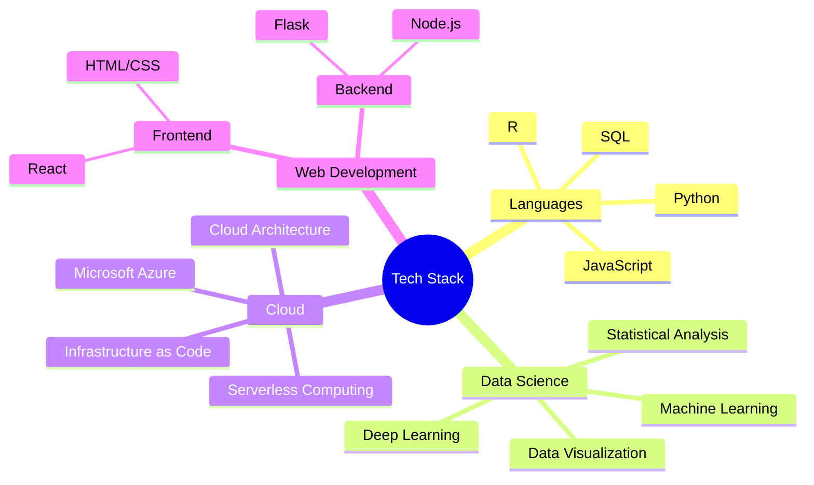

<div align="center">
  
#  Hello World! I'm Hassan Ʌʟı

[](https://github.com/MadCkull)
[](https://github.com/MadCkull?tab=followers)
[](https://github.com/MadCkull?tab=stars)

<h3>
   
  Data Scientist | 🌩️ Cloud Computing Architect | 🚀 Full Stack Developer
</h3>

<p align="center">
  <a href="mailto:MadCkull@gmail.com">
    
  </a>
  <a href="https://www.linkedin.com/in/your-profile/">
    
  </a>
  <a href="https://your-portfolio.com">
    
  </a>
  <a href="https://discord.gg/your-discord">
    
  </a>
  <a href="https://twitter.com/your-twitter">
    
  </a>
</p>

<br/>

[](https://git.io/typing-svg)

---

</div>

##  About Me


Passionate **Data Scientist** and **Full Stack Developer** with an expertise in advanced machine learning algorithms and cloud computing architectures. Recent Computer Science graduate with a strong analytical mindset and a drive for solving complex problems through data-driven approaches.

I thrive in developing innovative solutions using cutting-edge technologies and am committed to continuous learning in the ever-evolving tech landscape. My work combines technical precision with creative problem-solving to deliver robust, scalable solutions.

<details>
<summary><b>🧠 My Technology Philosophy</b></summary>
<br>
I believe technology should enhance human capabilities, not replace them. I'm committed to building ethical AI systems that are explainable, fair, and beneficial for society. Every project I undertake aims to bridge gaps between complex technical solutions and practical human needs.
</details>

<div align="center">
    
</div>

## 🔭 Current Focus

<div align="center">
    <table>
        <tr>
            <td align="center" width="140">
                
                <br>Advanced ML Algorithms
            </td>
            <td align="center" width="140">
                
                <br>Microsoft Azure
            </td>
            <td align="center" width="140">
                
                <br>Deep Learning
            </td>
            <td align="center" width="140">
                
                <br>Containerization
            </td>
            <td align="center" width="140">
                
                <br>Big Data Analytics
            </td>
        </tr>
    </table>
</div>

##  Technical Skills



## 🛠️ Languages and Tools

<div align="center">
<p align="center">
  <a href="https://skillicons.dev">
    
  </a>
</p>
</div>

## 📊 GitHub Analytics

<div align="center">
  
  
</div>

## 🔥 Contribution Streak

<div align="center">
  
</div>

## 🏆 GitHub Trophies

<div align="center">
  
</div>

## 📈 Contribution Graph

<div align="center">
  
</div>

## 📌 Featured Projects

<div align="center">
  <a href="https://github.com/MadCkull/MadEye">
    
  </a>
  <a href="https://github.com/MadCkull/WSAppBak">
    
  </a>
</div>

<details>
  <summary><b>View All Projects</b></summary>
  
  ### Data Science & Machine Learning
  - **[Predictive Analysis System](https://github.com/MadCkull)**: Time series forecasting model using LSTM neural networks
  - **[Sentiment Analysis Tool](https://github.com/MadCkull)**: NLP-based sentiment analysis for social media content
  
  ### Cloud Computing Solutions
  - **[Serverless Data Pipeline](https://github.com/MadCkull)**: Azure Functions-based ETL workflow
  - **[Multi-Cloud Deployment Framework](https://github.com/MadCkull)**: Infrastructure as Code templates for multi-cloud deployments
  
  ### Full Stack Applications
  - **[Real-time Dashboard](https://github.com/MadCkull)**: React & Node.js application with real-time data visualization
  - **[IoT Monitoring Platform](https://github.com/MadCkull)**: End-to-end solution for IoT device monitoring
</details>

## 🎓 Certifications & Education

<div align="left">
  <table>
    <tr>
      <td>
        
      </td>
      <td>
        Advanced data analysis & predictive modeling on cloud platforms
      </td>
    </tr>
    <tr>
      <td>
        
      </td>
      <td>
        Deep learning model development and deployment
      </td>
    </tr>
    <tr>
      <td>
        
      </td>
      <td>
        Comprehensive training in data analysis & machine learning algorithms
      </td>
    </tr>
    <tr>
      <td>
        
      </td>
      <td>
        Specialized training in Azure cloud architecture & services
      </td>
    </tr>
  </table>
</div>

## 📝 Latest Blog Posts

<div align="left">
  <a href="#"></a><br/>
  <a href="#"></a><br/>
  <a href="#"></a>
</div>

## 📈 Weekly Development Breakdown

```text
Python       ███████████████░░░░   65.27%
JavaScript   ██████░░░░░░░░░░░░░   25.48%
Markdown     █░░░░░░░░░░░░░░░░░░   04.83%
YAML         █░░░░░░░░░░░░░░░░░░   03.47%
Other        ░░░░░░░░░░░░░░░░░░░   00.95%
```

---

<div align="center">
  
  
  <h3>💬 Let's Connect and Collaborate!</h3>
  
  <p>Whether you're looking for a collaborator on a project, have questions about data science or cloud computing, or just want to chat about the latest tech trends - I'm always open to connecting with fellow developers and enthusiasts.</p>
</div>

<div align="center">
  
</div>
